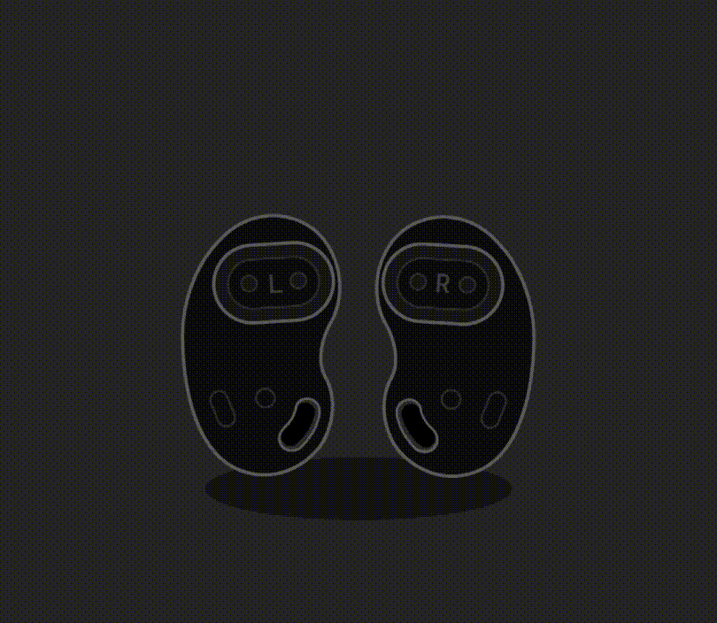
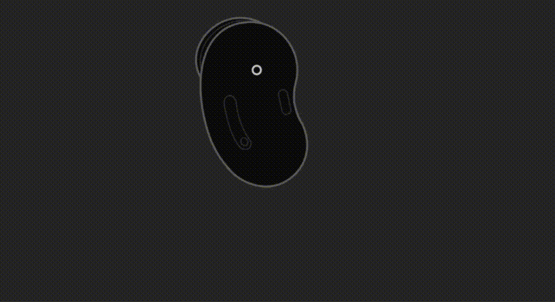
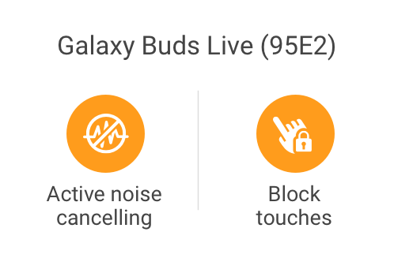
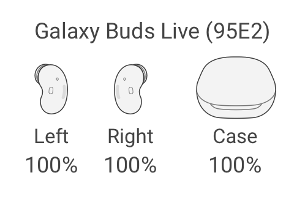
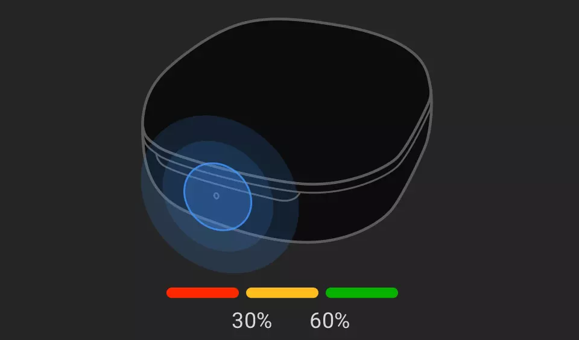
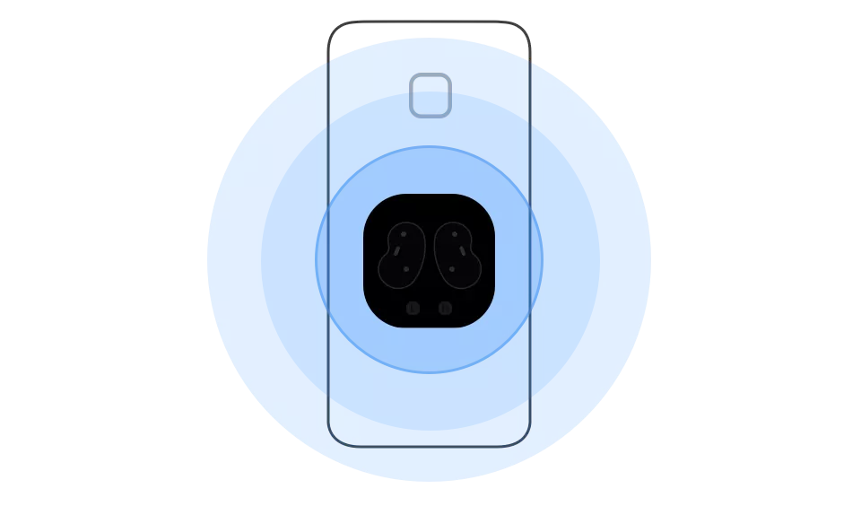

# GalaxyBudsLive Disassembly Writeup
Analysis of the unreleased Galaxy Buds Live (aka Neobeans) plugin app for Android (as of 7/24/2020; expected release date: 5/8/2020)

## Introduction

This repository contains all information I was able to find while searching through the Galaxy Buds Live plugin app for Android. I'll try to document my findings in this repository.

This is the API I accessed in order to get their pre-release APK: <https://vas.samsungapps.com/stub/stubDownload.as?appId=com.samsung.accessory.neobeanmgr&deviceId=SM-G950F&mcc=262&mnc=03&csc=DBT&sdkVer=28&pd=0&systemId=0000000000000&callerId=com.samsung.android.app.watchmanager&abiType=64&extuk=000000000000000>

And this is the actual link to the APK (from the response of the previous URL): <http://samsappsbn.vo.llnwd.net/astore_bin/dqasvgmgej/2020/0707/prePost_20200707060019839.apk?ctnt_id=000005094632&bsize=9344359&e=1595621530&h=e3169cb92bef5ccdbcd77deb639a66f5>

## Resources

### Animated tutorials

Original MP4 files are stored here: [/resources/res/raw/](disassembly_2020-07-06/resources/res/raw/)

| How to wear the Buds Live correctly!                         | How to pair                                                  |
| ------------------------------------------------------------ | ------------------------------------------------------------ |
|  |  |

| Double tap                                                   | Tap and hold                                                 |
| ------------------------------------------------------------ | ------------------------------------------------------------ |
|  |  |

| Triple tap                                                   | Single tap                                                   |
| ------------------------------------------------------------ | ------------------------------------------------------------ |
|  |  |

### Loose detection

The Buds Live can detect if they are not properly inserted in your ears. If one bud doesn't not fit correctly it will show a red border around it in the app (displayed in one of the tip cards, not on the battery card):

| Left                                                         | Right                                                        |
| ------------------------------------------------------------ | ------------------------------------------------------------ |
| Good | Good |
| Loose | Loose |

##### Related Strings (Loose detection)

```xml
<string name="tips_earbuds_fit_results">Earbuds fit result</string>
<string name="tips_good_fit">Good fit</string>
<string name="tips_loose">Loose</string>
<string name="tips_you_have_gor_a_good_fit">
You\'ve got a good fit that will give you the best sound and active noise canceling.
</string>
<string name="tips_try_adjusting_your_earbuds">
Try adjusting your earbuds to get better sound and active noise canceling.
</string>
<string name="tips_try_adjusting_your_left_earbud">
Try adjusting your left earbud to get better sound and active noise canceling.
</string>
```

### Widget designs

| Quick actions                                                | Battery                                                      |
| ------------------------------------------------------------ | ------------------------------------------------------------ |
|  |  |

### Buds/Case

| Black                                                        | White                                                        |
| ------------------------------------------------------------ | ------------------------------------------------------------ |
|  |  |

### Other tutorials

| fd_home_tips_charging_battery_level                          | fd_home_tips_charging_using_phone                            |
| ------------------------------------------------------------ | ------------------------------------------------------------ |
|  |  |

## New Hardware

Some parts of the debugging mode within the Buds Live refer to a **gyroscope** and to a sensor called "`Vpu`" in both earpieces. **VPU** may be an abbreviation for "[Voice Pickup Sensor](https://www.sonion.com/vpu-voice-pick-up-sensor/)" which enhances voice recording especially for calls and can pickup voice wake-up commands. **This new sensor is used with the new [Voice Wakeup Feature](#voice-wake-up)!**

```
[L>Gyro 0]: XXXX
[L>Gyro 1]: XXXX
[L>Gyro 2]: XXXX
[R>Gyro 0]: XXXX
[R>Gyro 1]: XXXX
[R>Gyro 2]: XXXX

[L>Vpu 0]: XXXX
[L>Vpu 1]: XXXX
[L>Vpu 2]: XXXX
[R>Vpu 0]: XXXX
[R>Vpu 1]: XXXX
[R>Vpu 2]: XXXX
```

Refer to: [/sources/com/samsung/accessory/neobeanmgr/core/service/message/MsgDebugData.java](disassembly_2020-07-06/sources/com/samsung/accessory/neobeanmgr/core/service/message/MsgDebugData.java)

## Source code

### Ambient sound? 

Apart from the gaming mode entry in the Labs screen, there's also a new interesting option called "Relieve pressure with ambient sound" (aka `PASSTHROUGH`):

According to its description:

> **"This can prevent a feeling of stuffiness or compression when you\'re not using active noise canceling."**

This sounds like a stripped down/recycled ambient sound feature...

##### Related Strings

```xaml
<string name="relieve_pressure_ambient_sound_desc">
This can prevent a feeling of stuffiness or compression when you\'re not using active noise canceling.
</string>
<string name="relieve_pressure_ambient_sound_title">Relieve pressure with ambient sound</string>
```

Refer to: [/sources/com/samsung/accessory/neobeanmgr/module/mainmenu/LabsActivity.java](disassembly_2020-07-06/sources/com/samsung/accessory/neobeanmgr/module/mainmenu/LabsActivity.java) 

### Voice wake-up

In the advanced screen, we have a new feature called "Voice wake-up". It can be used to activate Bixby using "Hey Bixby" via the Buds Live without pressing any button on the buds. This is accomplished thanks to the new [voice activation sensor (VPU)](#new-hardware).

However, this is Samsung-only since it only works with Bixby.

##### Related Strings

```xaml
<string name="settings_voice_wakeup_desc">
You can call Bixby by saying “%s” while wearing your earbuds.
</string>
<string name="settings_voice_wakeup_oobe_incomplete_desc">Set up Bixby to use Voice wakeup.</string>
<string name="settings_voice_wakeup_title">Bixby voice wake-up</string>
```

Refer to: [/sources/com/samsung/accessory/neobeanmgr/module/mainmenu/AdvancedActivity.java](disassembly_2020-07-06/sources/com/samsung/accessory/neobeanmgr/module/mainmenu/AdvancedActivity.java) 

### Touchpad Options

* Bixby/Voice assistant
* ANC
* Volume
* Spotify (hidden if not available)
* Other compatible media apps (hidden if not available)

### Bixby

You can enable/disable ANC by Voice command, but otherwise than that, they haven't added anything now to it. No changes for bixby routines at all.

Refer to: [/sources/com/samsung/accessory/neobeanmgr/core/bixby/BixbyTurnOnFeature.java](disassembly_2020-07-06/sources/com/samsung/accessory/neobeanmgr/core/bixby/BixbyTurnOnFeature.java)

### Find my mobile

Interestingly, the app refers to the FMM API (Find my mobile, NOT Find my gear). It may allow users, to let the Buds ring using the Find my mobile website/app and to retrace their steps using phone's GPS if you lost your Buds Live or to display the GPS location when they were last seen by the Android device. This is just a guess though.

Refer to: [/sources/com/samsung/accessory/neobeanmgr/core/fmm/](disassembly_2020-07-06/sources/com/samsung/accessory/neobeanmgr/core/fmm/)

### Analytics

Just like the Buds and Buds+ app, this one is littered with usage analytics as well. Every now and then, the Buds send a usage report to the host device.

This includes data like: Single/double/triple tap count, tap-and-hold count, playback duration, wearing duration, ANC duration, low battery alert count, firmware error count, and much more.

Refer to: [/sources/com/samsung/accessory/neobeanmgr/core/service/EarBudsUsageReporter.java](disassembly_2020-07-06/sources/com/samsung/accessory/neobeanmgr/core/service/EarBudsUsageReporter.java)

### Debug Menu

The Buds Live get a hidden debug menu as well. It'll work the same way the one for the Buds+ did. Check my reddit post (includes instructions) about this: <https://www.reddit.com/r/galaxybuds/comments/hjgfaf/galaxy_buds_i_found_a_new_debug_menu/>

### Future Online Manual

As of writing this, the online-manual is not yet available but this may change in the next days/weeks. When it becomes available, you can check it out here: <http://www.samsung.com/m-manual/mod/SM-R180>

### Menu Overview

#### Home

* ANC
* Equalizer
* Battery Percentages

#### Advanced

* Voice wakeup

* Seamless connection

#### General

* Factory reset
* User manual

#### Labs

* Gaming mode
* Relieve pressure with ambient sound

#### Touchpad

* Lock touchpad
* Change left/right tap-and-hold actions

#### Read notifications aloud

* Same as the Buds/Buds+; exactly what you would expect

#### Find my buds

* Same as the Buds/Buds+; exactly what you would expect


___________

Check my [Unofficial Windows client](https://github.com/ThePBone/GalaxyBudClient) for the Buds and Buds+ out!
